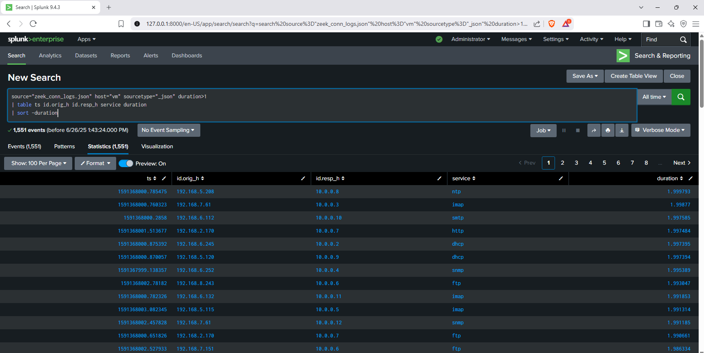
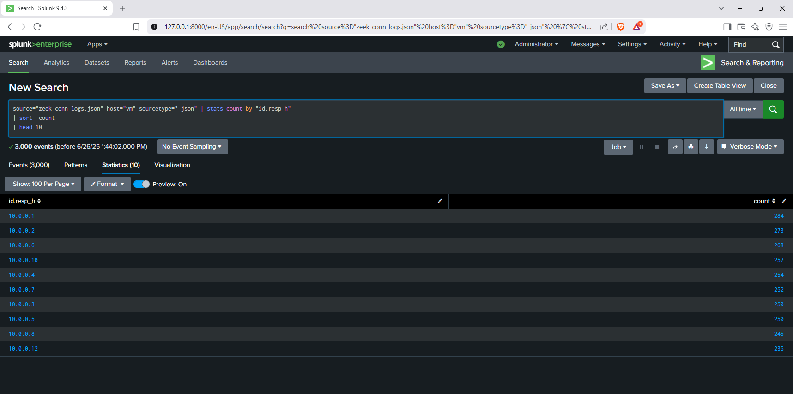
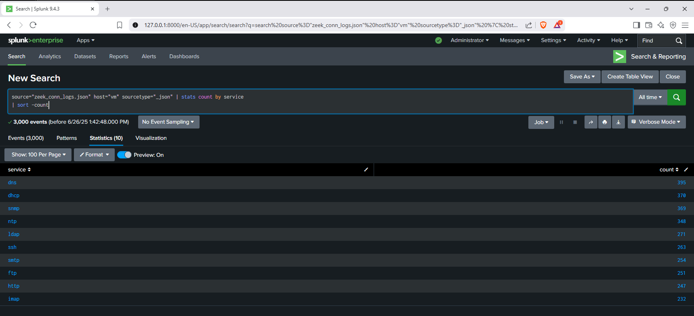
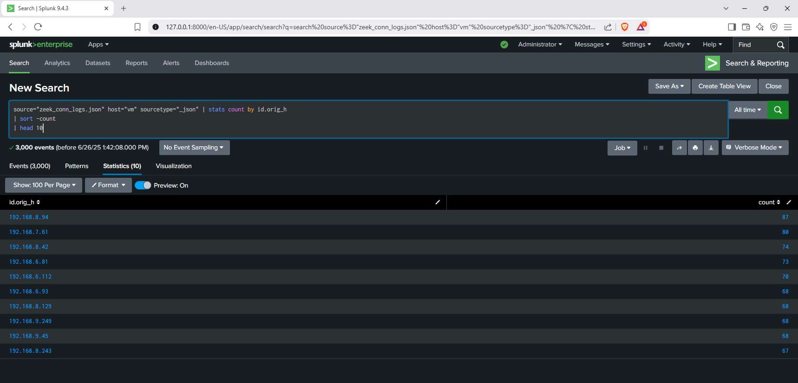

# Network Connection Log Analysis with Splunk SIEM 🌐


---

## 📋 Project Overview

This project analyzes network connection logs using Splunk SIEM, focusing on connection durations, most accessed internal servers, most common services, and the top client IPs. The analysis provides insights into network usage patterns, potential hotspots, and service utilization.

---

## 🏅 Key Skills & Outcomes

- **SIEM Log Analysis:** Ingested and analyzed Zeek connection logs for operational and security insights.
- **SPL Querying:** Developed and executed SPL queries for service, server, and client analysis.
- **Network Monitoring:** Identified most accessed servers, common services, and active clients.
- **Reporting:** Presented findings with clear tables and visualizations.

---

## 🗂️ Analysis Summary

### 1. ⏱️ Connections with Duration > 1 Second

- **Query Used:**
```
source="zeek_conn_logs.json" host="vm" sourcetype="_json" duration>1
| table ts id.orig_h id.resp_h service duration
| sort -duration
```
- **Findings:**
- 1,551 events where the connection duration exceeded 1 second.
- Shows which client and server pairs maintained longer sessions and over which services.

- **Screenshot:**


---

### 2. 🖥️ Most Accessed Internal Servers

- **Query Used:**
```
source="zeek_conn_logs.json" host="vm" sourcetype="_json"
| stats count by id.resp_h
| sort -count
| head 10
```
- **Findings:**
- Lists the top 10 internal server IPs most frequently accessed.
- Useful for identifying popular or critical assets in the network.

- **Screenshot:**


---

### 3. 🛠️ Most Common Services

- **Query Used:**
```
source="zeek_conn_logs.json" host="vm" sourcetype="_json"
| stats count by service
| sort -count
```
- **Findings:**
- Shows the most commonly used network services (e.g., DNS, DHCP, SNMP, NTP, LDAP, SSH, HTTP, etc.).
- Helps understand service usage and potential exposure.

- **Screenshot:**


---

### 4. 👤 Top 10 Client IPs (Most Active Clients)

- **Query Used:**
```
source="zeek_conn_logs.json" host="vm" sourcetype="_json"
| stats count by id.orig_h
| sort -count
| head 10
```
- **Findings:**
- Reveals the most active client IPs initiating network connections.
- Useful for monitoring user/device behavior and spotting anomalies.

- **Screenshot:**


---
## 💡 What Was Done

- **Ingested Zeek connection logs** from `zeek_conn_logs.json` into Splunk.
- **Executed SPL queries** to analyze connection durations, server and client activity, and service usage.
- **Visualized results** using Splunk dashboards and included all relevant screenshots in this documentation.

---

## 🚀 Summary of Outcomes

- Gained hands-on experience with Splunk SIEM for connection log analysis.
- Identified long-duration sessions, key internal servers, most-used services, and top client IPs.
- Developed skills in log parsing, SPL querying, and network behavior analysis.

---
