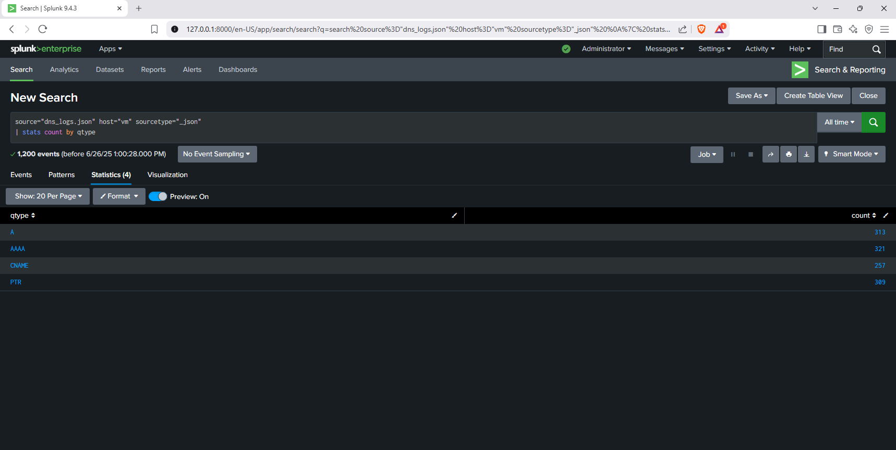
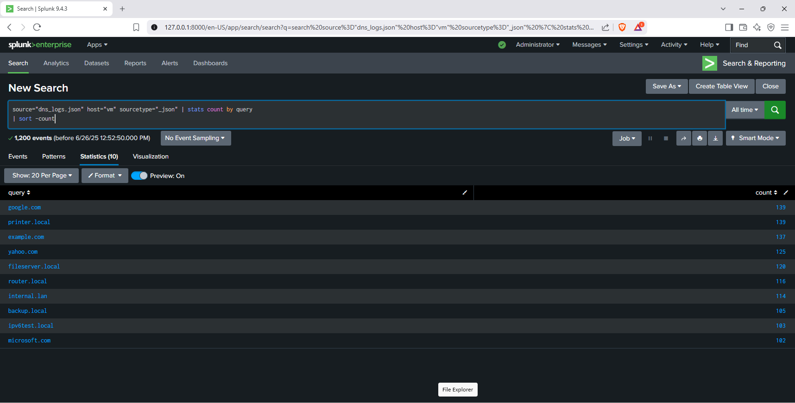
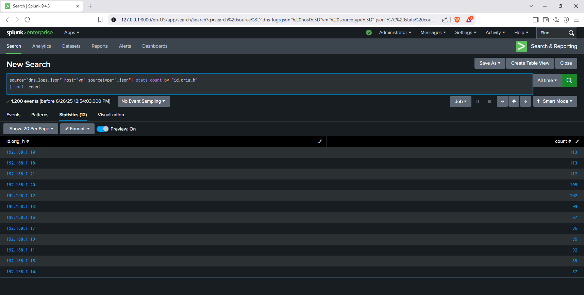
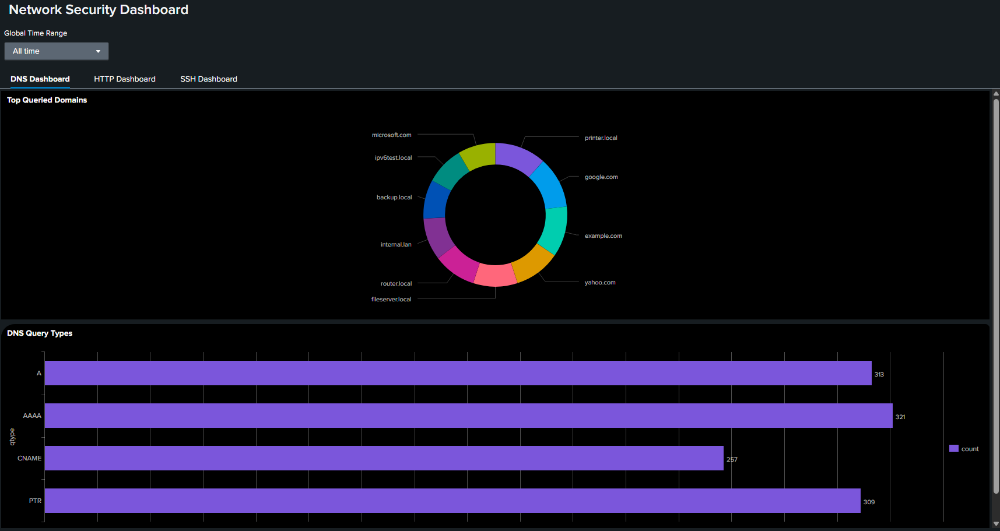

# DNS Log Analysis with Splunk 🚦


## 📋 Project Summary

This project demonstrates DNS log analysis using Splunk Enterprise. The analysis covered 1,200 DNS events from a JSON log source. Key focus areas included query type breakdown, most queried domains, and the most active source IPs. Visualizations and statistics were generated using Splunk SPL queries.

---

## 📊 Key Outcomes

- **Analyzed DNS traffic** from 1,200 events using Splunk
- **Identified top DNS query types** (A, AAAA, CNAME, PTR)
- **Ranked most queried domain names** (internal and external)
- **Determined most active source IPs** generating DNS queries
- **Created visualizations** for each analysis category

---

## 🛠️ Key Skills Gained

- Splunk SPL querying and dashboarding
- Log parsing and event correlation
- DNS protocol analysis
- Data visualization and reporting
- Network security monitoring fundamentals

---

## 📈 Analysis Results

### 1. DNS Query Type Breakdown
 # DNS Query Types
    - A:  Maps a domain name to its corresponding IPv4 address
    - AAAA: Maps a domain name to its corresponding IPv6 address
    - CNAME: Finds the real (canonical) name for an alias 
	- PTR: Reverse lookup from IP to domain name 
	
| Query Type | Count |
|------------|-------|
| A          | 313   |
| AAAA       | 321   |
| CNAME      | 257   |
| PTR        | 309   |



---

### 2. Most Frequently Queried Domain Names

| Domain Name        | Count |
|--------------------|-------|
| google.com         | 139   |
| printer.local      | 139   |
| example.com        | 137   |
| yahoo.com          | 125   |
| fileserver.local   | 120   |
| router.local       | 116   |
| internal.lan       | 114   |
| backup.local       | 105   |
| ipv6test.local     | 103   |
| microsoft.com      | 102   |



---

### 3. Most Active Source IPs

| Source IP       | Count |
|-----------------|-------|
| 192.168.1.18    | 113   |
| 192.168.1.10    | 113   |
| 192.168.1.21    | 112   |
| 192.168.1.28    | 105   |
| 192.168.1.12    | 102   |
| 192.168.1.13    | 99    |
| 192.168.1.17    | 97    |
| 192.168.1.19    | 96    |
| 192.168.1.11    | 95    |
| 192.168.1.15    | 92    |
| 192.168.1.14    | 89    |
| 192.168.1.14    | 87    |




---

## 💡 What Was Done

- **SPL queries** were used to extract and aggregate DNS log data:
    - Query type breakdown:
      ```
      source="dns_logs.json" host="vm" sourcetype="json" | stats count by qtype
      ```
    - Most queried domains:
      ```
      source="dns_logs.json" host="vm" sourcetype="json" | stats count by query | sort -count
      ```
    - Most active source IPs:
      ```
      source="dns_logs.json" host="vm" sourcetype="json" | stats count by "id.orig_h" | sort -count
      ```
- **Visualizations** were created for key metric.



---

## 🚀 Summary of Outcomes

- Gained hands-on experience with Splunk for log analysis
- Developed skills in DNS traffic investigation and reporting
- Produced actionable insights on network activity for IT/security teams

---
