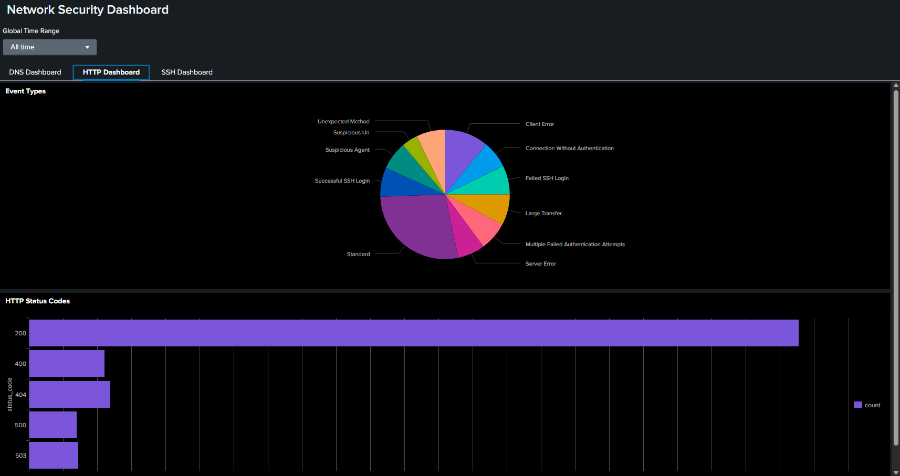

# HTTP Log Analysis with Splunk SIEM 🚦


---

## 📋 Project Overview

This project analyzes HTTP server logs using Splunk SIEM. The analysis focuses on identifying large file transfers, counting server errors, finding the most active endpoints, and detecting suspicious user agents associated with scripted or automated attacks.

---

## 🏅 Key Skills & Outcomes

- **SIEM Log Analysis:** Used Splunk to ingest and analyze HTTP logs for security and operational insights.
- **SPL Querying:** Developed and executed SPL queries for advanced filtering, aggregation, and reporting.
- **Threat Detection:** Detected potential scripted attacks and high-error endpoints.
- **Reporting:** Summarized findings with tables and visualizations for clear communication.

---

## 🗂️ Analysis Summary

### 1. 🔥 Large File Transfers (>500 KB)

- **Query Used:**  
```
   source="http_logs.json" host="vm" sourcetype="json" resp_body_len>500000
| table ts "id.orig_h" "id.resp_h" uri resp_body_len
| sort -resp_body_len
```
- **Findings:**  
- 323 events with HTTP response bodies larger than 500 KB.
- Top endpoints and hosts involved in large data transfers are identified.

- **Screenshot:**  


---

### 2. 🚨 Number of Server Errors (HTTP 5xx)

- **Query Used:**  
```
source="http_logs.json" host="vm" sourcetype="json" status_code>=500 status_code<600
| stats count as server_errors
```
- **Findings:**  
- 285 server error (5xx) responses detected, indicating backend or application issues.

- **Screenshot:**  


---

### 3. 🌐 Top 10 Endpoints Generating Web Traffic

- **Query Used:**  
```
source="http_logs.json" host="vm" sourcetype="json"
| stats count by "id.orig_h"
| sort -count
| head 10
```
- **Findings:**  
- Identified the top 10 source IPs generating the most web traffic.

- **Screenshot:**  


---

### 4. 🕵️ User Agents Associated with Possible Scripted Attacks

- **Query Used:**  
```
source="http_logs.json" host="vm" sourcetype="json"
user_agent IN ("sqlmap/1.5.1", "curl/7.68.0", "python-requests/2.25.1", "botnet-checker/1.0")
| stats count by user_agent
```
- **Findings:**  
- Detected user agents commonly linked to automated tools and potential malicious activity:
  - `sqlmap/1.5.1`, `python-requests/2.25.1`, `curl/7.68.0`, `botnet-checker/1.0`

- **Screenshot:**  


---

## 💡 What Was Done

- **Ingested HTTP logs** from `http_logs.json` into Splunk.
- **Executed SPL queries** to:
- Identify large file transfers.
- Count server-side errors.
- Find the most active endpoints.
- Detect suspicious user agents.
- **Visualized results** using Splunk's dashboard and reporting features.


---
## 🚀 Summary of Outcomes

- Gained hands-on experience with Splunk SIEM for HTTP log analysis.
- Detected high-volume data transfers and backend errors.
- Identified endpoints and user agents linked to potential automated or malicious activity.
- Developed skills in log parsing, SPL querying, and threat detection.

---
