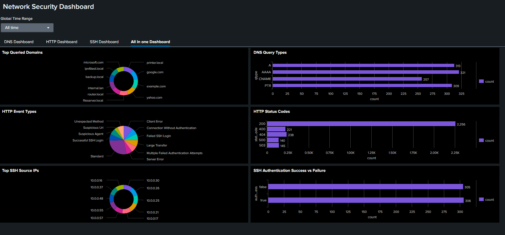

# Unified Network Security Log Analysis with Splunk SIEM 🛡️

---

## 🎯 Objective

To achieve unified visibility and actionable insights across DNS, HTTP, and SSH network activity by leveraging Splunk SIEM for log ingestion, analysis, and visualization. This enables proactive monitoring, anomaly detection, and enhanced security posture for enterprise environments.

---

## 🖥️ Lab Setup

- **Platform:** Splunk Enterprise (installed and configured)
- **Data Sources:** DNS, HTTP, and SSH logs in JSON format
- **Dashboard:** All-in-one Splunk dashboard visualizing key metrics from all log types

---

## ⚙️ Steps to Upload HTTP Log into Splunk

1. **Go to Splunk Web** → `Settings > Add Data`
2. **Choose Upload** and select your file (e.g., `all_log.json`)
3. **Set Source type:** Choose `json` or create a new source type if needed
4. **Index:** Select `main` or create a new index for your data
5. **Finish the upload** and confirm that indexing is successful

---

## 🏅 Overall Skills Gained

- Splunk installation, configuration, and data onboarding
- Ingesting and indexing structured log data (DNS, HTTP, SSH)
- Writing and optimizing SPL queries for multi-source analytics
- Designing dashboards and visualizations for real-time security monitoring
- Detecting threats, anomalies, and operational issues using SIEM workflows
- Presenting findings and collaborating with security/IT teams

---

## 🖥️ Main Dashboard Overview

---

## 🔍 Detailed Analysis

### 1. 🟣 DNS Log Insights

**Top Queried Domains:**  
- Internal: `printer.local`, `fileserver.local`, `router.local`, `internal.lan`, `backup.local`, `ipv6test.local`
- External: `google.com`, `example.com`, `yahoo.com`, `microsoft.com`

**DNS Query Types:**  
| Type   | Count |
|--------|-------|
| A      | 313   |
| AAAA   | 321   |
| CNAME  | 257   |
| PTR    | 309   |

- **Observation:** High volume of both IPv4 (A) and IPv6 (AAAA) queries, with significant use of PTR (reverse lookup) and CNAME (alias) records.

---

### 2. 🟣 HTTP Log Insights

**HTTP Event Types:**  
- Standard, Successful SSH Login, Suspicious Agent, Suspicious URL, Unexpected Method, Client Error, Connection Without Authentication, Failed SSH Login, Large Transfer, Multiple Failed Authentication Attempts, Server Error

**HTTP Status Codes:**  
| Status | Count |
|--------|-------|
| 200    | 2,256 |
| 400    | 221   |
| 404    | 238   |
| 500    | 140   |
| 503    | 145   |

- **Observation:** Most responses are successful (200), but notable client (400/404) and server errors (500/503) indicate areas for further investigation. Presence of suspicious and unexpected HTTP events suggests possible probing or attack attempts.

---

### 3. 🟣 SSH Log Insights

**Top SSH Source IPs:**  
- Most active: `10.0.0.16`, `10.0.0.37`, `10.0.0.48`, `10.0.0.55`, `10.0.0.57`, `10.0.0.30`, `10.0.0.26`, `10.0.0.21`, `10.0.0.17`

**SSH Authentication Success vs Failure:**  
| Result | Count |
|--------|-------|
| true   | 306   |
| false  | 305   |

- **Observation:** Nearly equal numbers of successful and failed SSH logins, highlighting potential brute-force activity or misconfigurations. Top source IPs should be reviewed for legitimacy.

---

## 💡 What Was Done

- Installed and configured Splunk Enterprise for log analysis.
- Uploaded and indexed DNS, HTTP, and SSH logs.
- Executed SPL queries for:
  - DNS: Query type and domain frequency analysis.
  - HTTP: Event type, status code, and anomaly detection.
  - SSH: Authentication success/failure and source IP analysis.
- Correlated findings across protocols for holistic visibility.
- Visualized results in an integrated dashboard.

---

## 🚀 Summary of Outcomes

- Achieved unified network visibility across DNS, HTTP, and SSH.
- Detected authentication risks, service errors, and suspicious access patterns.
- Enhanced skills in log parsing, SIEM analytics, and security reporting.

---

