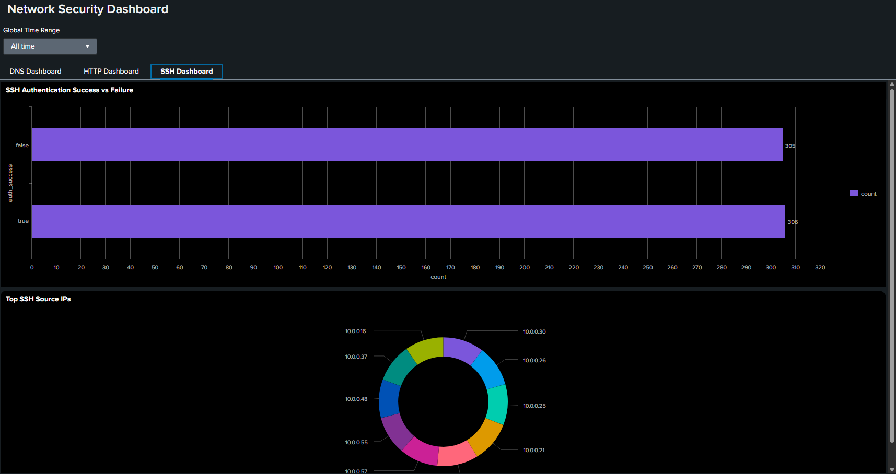

# SSH Log Analysis with Splunk SIEM 🔐


---

## 📋 Project Overview

This project analyzes SSH log events using Splunk SIEM. The analysis identifies the distribution of SSH event types, the most active endpoints (hosts) for failed SSH logins, and the total number of SSH connections observed. All insights are supported by visualizations generated from Splunk searches.

---

## 🏅 Key Skills & Outcomes

- **SIEM Log Analysis:** Ingested and analyzed SSH logs for security and operational insights.
- **SPL Querying:** Developed and executed SPL queries for event categorization and endpoint analysis.
- **Threat Detection:** Identified endpoints with high failed authentication attempts.
- **Reporting:** Presented findings with clear tables and screenshots.

---

## 🗂️ Analysis Summary

### 1. 📊 SSH Event Type Distribution

- **Query Used:**
```
source="ssh_logs.json" host="vm" sourcetype="json" | stats count by event_type
```
- **Findings:**  
- The logs contain a mix of successful logins, failed logins, multiple failed attempts, and connections without authentication.
- Distribution:
  - Successful SSH Login: 306
  - Failed SSH Login: 305
  - Multiple Failed Authentication Attempts: 303
  - Connection Without Authentication: 286

- **Screenshot:**  


---

### 2. 🌐 Top 10 Endpoints with Failed SSH Login Attempts

- **Query Used:**
```
source="ssh_logs.json" host="vm" sourcetype="json" | stats count by "id.orig_h" | sort -count | head 10
```
- **Findings:**  
- Identified the top 10 source IPs with the most failed SSH login attempts.
- These endpoints may indicate sources of brute-force attacks or misconfigured systems.

- **Screenshot:**  


---

### 3. 🔢 Total SSH Connections Observed

- **Query Used:**
```
source="ssh_logs.json" host="vm" sourcetype="json" | stats count as total_ssh_connections
```
- **Findings:**  
- Total SSH connections recorded in the dataset: **1,200**

- **Screenshot:**  


---

## 💡 What Was Done

- **Ingested SSH logs** from `ssh_logs.json` into Splunk.
- **Executed SPL queries** to:
- Categorize SSH event types.
- Identify endpoints with frequent failed logins.
- Count total SSH connection events.
- **Visualized results** using Splunk dashboards.


---
## 🚀 Summary of Outcomes

- Gained practical experience with Splunk SIEM for SSH log analysis.
- Detected patterns of authentication success and failure.
- Identified endpoints with high failed SSH login activity for further investigation.
- Developed skills in log parsing, SPL querying, and security event reporting.

---

