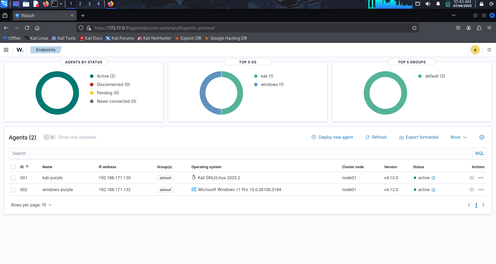
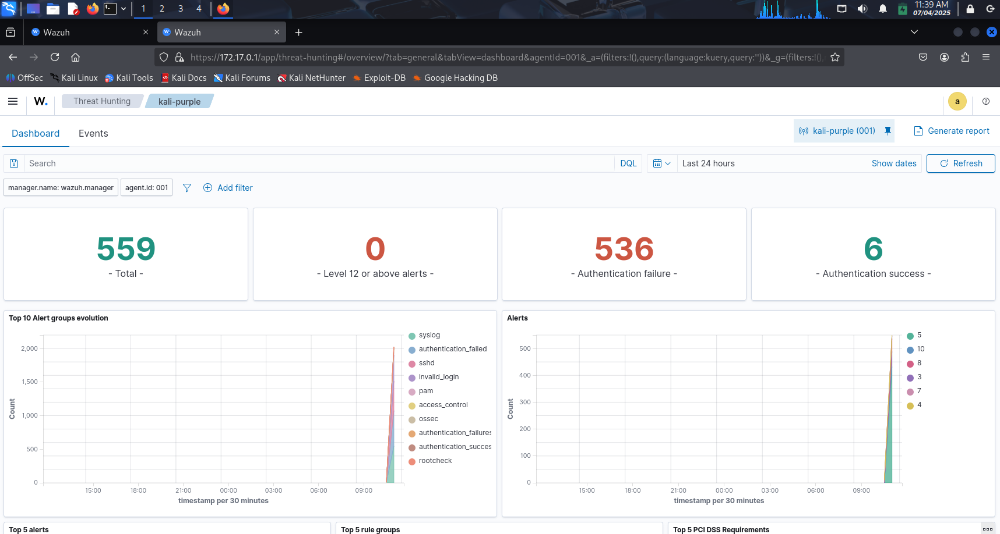
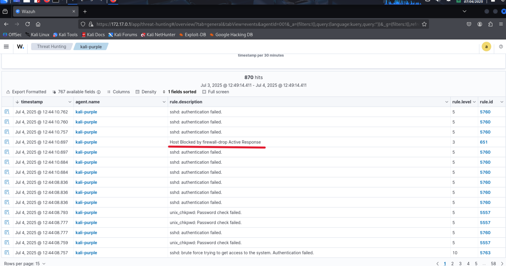
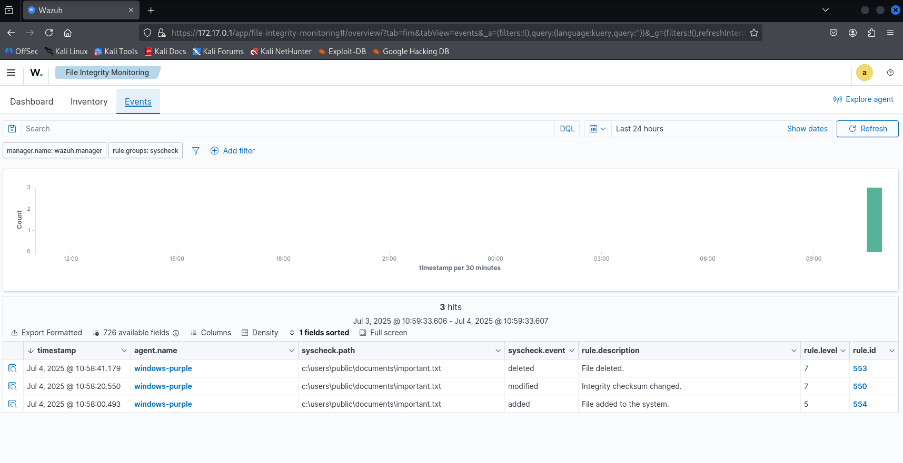

# Wazuh EDR Lab: Real-World SOC Simulation


Welcome to my hands-on project demonstrating advanced Endpoint Detection & Response (EDR) and File Integrity Monitoring (FIM) using Wazuh. This lab simulates real-world SOC (Security Operations Center) scenarios, highlighting my skills in deploying, configuring, and operationalizing security tools to detect and respond to cyber threats.

---
## 🎯 Objective
Demonstrate hands-on blue team skills in deploying, configuring, and simulating real-world threat detection and response using Wazuh EDR and File Integrity Monitoring.
  
## 🚀 Project Overview

- **Wazuh Server:** Kali Linux (2025.2), deployed via Docker.
- **Agents Deployed:**
  - `kali-purple` (Kali Linux endpoint)
  - `windows-purple` (Windows 11 Pro endpoint)
- **Simulations:**
  - SSH brute-force attack detection and automated response
  - File Integrity Monitoring with simulated file changes and alerting

---

## 🛠️ Environment & Architecture

| Component       | OS/Version                  | IP Address         | Status  |
|-----------------|----------------------------|--------------------|---------|
| kali-purple     | Kali GNU/Linux 2025.2       | 192.168.171.130    | Active  |
| windows-purple  | Windows 11 Pro 10.0.26100   | 192.168.171.132    | Active  |

- **Wazuh Version:** v4.12.0

- 📸 **Endpoint Overview**  


---

## 🔥 Attack Simulation & Detection

### SSH Brute-Force Attack

- **Attack Source:** Ubuntu machine
- **Target:** kali-purple agent
- **Detection & Response:**
  - Wazuh detected multiple failed SSH authentication attempts
  - Rule triggered: SSH brute-force (Rule ID: 5763, Level: 10)
  - Automated Active Response: Attacker IP (`192.168.171.133`) was blocked
  
## ⚙️ Simulation Techniques

### 🔐 SSH Brute-Force (Ubuntu Attacker)
``` bash
 hydra -l kali -P /usr/share/wordlists/rockyou.txt <target_ip> SSH
```

#### Log Evidence

| Timestamp                | Agent        | Rule Description                                           | Level | Rule ID | Source IP         |
|--------------------------|-------------|-----------------------------------------------------------|-------|---------|-------------------|
| Jul 4, 2025 @ 12:11:58   | kali-purple | sshd: brute force trying to get access to the system. Authentication failed. | 10    | 5763    | 192.168.171.133   |
| Jul 4, 2025 @ 12:34:04   | kali-purple | sshd: brute force trying to get access to the system. Authentication failed. | 10    | 5763    | 192.168.171.133   |
| Jul 4, 2025 @ 11:13:49   | kali-purple | sshd: brute force trying to get access to the system. Non existent user.     | 10    | 5712    | 192.168.171.133   |

- 📸 **Threat Hunting ssh bruteforce View**  



- 📸 **Result:** Wazuh’s Active Response module automatically blocked the attacker’s IP after detecting brute-force activity. 



## 📝 File Integrity Monitoring (FIM)

### Simulated File Changes

- **Monitored Path:** `c:\users\public\documents\important.txt` (Windows agent)
- **Events Detected:**
- File added
- File modified (integrity checksum changed)
- File deleted

## ⚙️ Simulation Techniques
``` Powershell
 echo "Sensitive Data" > "C:\Users\Public\Documents\important.txt"
 echo "Modified Content" >> "C:\Users\Public\Documents\important.txt"
 Remove-Item "C:\Users\Public\Documents\important.txt"
```

| Event      | Path                                      | Description                       |
|------------|-------------------------------------------|-----------------------------------|
| added      | c:\users\public\documents\important.txt   | File added to the system.         |
| modified   | c:\users\public\documents\important.txt   | Integrity checksum changed.       |
| deleted    | c:\users\public\documents\important.txt   | File deleted.                     |

- **Result:** All file changes were detected and alerted in real time, confirming effective FIM configuration.



## 📚 Reference
[Github link](https://github.com/0xrajneesh)

## 🧑‍💻 Key Skills Demonstrated

- **Security Tool Deployment:** Dockerized Wazuh server for scalable, rapid deployment.
- **Cross-Platform Agent Management:** Simultaneous Linux & Windows monitoring.
- **Threat Detection & Automated Response:** Real-time detection and blocking of SSH brute-force attacks.
- **File Integrity Monitoring:** Detection of file additions, modifications, and deletions.
- **SOC Visibility:** Dashboard analytics for alert trends, agent status, and rule performance.

---


